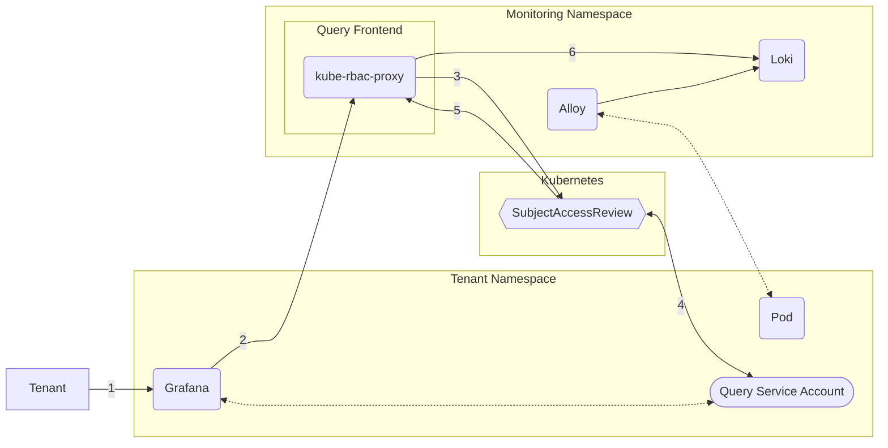

# Loki

See the [blog post](https://konst.fish/blog/Multi-Tenant-Loki-on-Kubernetes) for a detailed rundown on how to deploy this setup. These manifests will produce a Loki instance, a Promtail DaemonSet to collect logs from pods annotated with `logging: enabled` & a querier frontend which provides isolated access for tenants, separated by their namespaces. 

## Structure



## Setup

To get started quickly, you can create a Kustomize which sources the manifests from this repo:

```yaml
apiVersion: kustomize.config.k8s.io/v1beta1
kind: Kustomization

# patch in a namespace for all manifests
namespace: monitoring

resources:
  # you should lock the ref here to a specific tag or commit 
  # (or copy out the manifests to maintain locally)
  - github.com/konstfish/multi-tenant-observability/loki?ref=main
  # S3 Object Storage Credential Secret
  - loki-objstore-secret.yaml
```

### Not included

#### Object Storage Secret

A secret `loki-objstore-secret` like [secret.example.yaml](secret.example.yaml) is required.

#### Security

- NetworkPolicies should be created to prevent access to the Loki gateway.

### Included

#### [loki.yaml](loki.yaml)

A [HelmChart CRD](https://github.com/k3s-io/helm-controller) containing metadata for the Grafana Loki Helm Chart & patched values.

#### [alloy.yaml](alloy.yaml)

A [HelmChart CRD](https://github.com/k3s-io/helm-controller) containing metadata for the Grafana Alloy Helm Chart & patched values to make it:
- Only collect logs from Pods with a `logging: enabled` label
- Add labels to the collected log lines (pod name, node name, namespace name, etc.)
- Correctly tell Loki which Tenant the log line belongs to

#### [querier-frontend](querier-frontend)

Core piece of the setup, the querier frontend which proxies the Loki instance using [kube-rbac-proxy](https://github.com/brancz/kube-rbac-proxy) to enable isolated, role-based access. See the contained README for more details.

#### [tenant](tenant)

Everything a Tenant needs to access their logs, see the README in the folder.