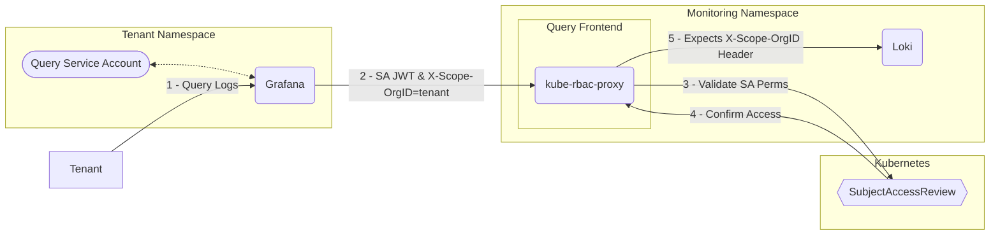

# Prometheus querier-frontend

## Structure

### Manifests

#### [config.yaml](config.yaml)

Contains config for `kube-rbac-proxy`. Extracts the value from the `X-Scope-OrgID` query parameter & creates a `SubjectAccessReview` to confirm the requesting account (which is derivated from the attached Authorization header, usually a Service Accounts JWT) has permissions on the `pods/logs` subresource. The verb corresponds to the [HTTP Method used for the call]( https://github.com/brancz/kube-rbac-proxy/blob/master/pkg/proxy/proxy.go#L48-L60.).

#### [deployment.yaml](deployment.yaml)

`kube-rbac-proxy` Deployment which forwards any successfully authenticated requests to the Loki Gateway. 

#### [serviceaccount.yaml](serviceaccount.yaml)

`kube-rbac-proxy` requires the `system:auth-delegator` `ClusterRole` to create `SubjectAccessReviews`.

#### [role.yaml](role.yaml)

Creates a `ClusterRole` "namespace-logs-viewer" which grants get on the `pods/logs` subresource. Tenants will require these rights to view logs in their namespace.