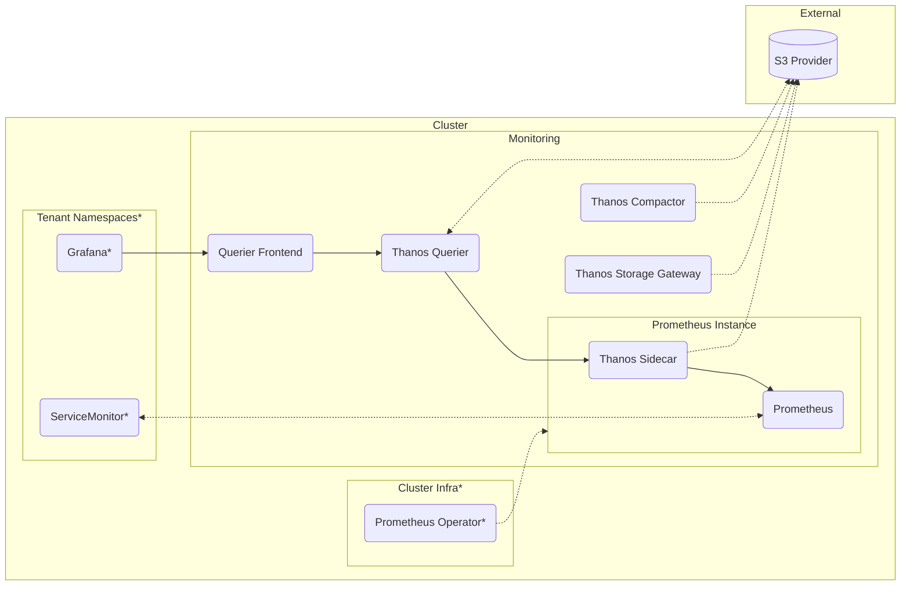

# Prometheus

See the [blog post](xxx link here) for a detailed rundown on how to deploy this setup. These manifests will produce a Prometheus instance, Thanos components & a querier frontend which provides access to tenants, segregated by their namespaces. 

## Structure



## Setup

To get started quickly, you can create a Kustomize which sources the manifests from this repo:

```yaml
apiVersion: kustomize.config.k8s.io/v1beta1
kind: Kustomization

# patch in a namespace for all manifests
namespace: monitoring

resources:
  # you should lock the ref here to a specific tag or commit 
  # (or copy out the manifests to maintain locally)
  - github.com/konstfish/multi-tenant-observability/prometheus?ref=main
  # S3 Object Storage Credential Secret used by Thanos
  - thanos-objstore-secret.yaml
```

### Not included

#### Object Storage Secret

A secret `thanos-objstore-secret` like [secret.example.yaml](secret.example.yaml) is required, see the [Prometheus Operator docs](https://prometheus-operator.dev/docs/platform/thanos/)

#### Security

- NetworkPolicies should be created to prevent access to the Prometheus instances & the Thanos sidecar directly.
- To prevent tenants from writing metrics into another tenant's space by relabeling, some kind of policy (like this sample [Gatekeeper Constraint](https://github.com/konstfish/shoal/blob/main/gitops/shoal/policy-template/block-servicemonitor-honor.yaml)) should be enforced. This is outlined [here](https://github.com/prometheus-community/prom-label-proxy#risks-outside-the-scope-of-this-project).

### Included

#### [prometheus.yaml](prometheus.yaml)

Simple Prometheus Instance definition, doesn't need any special adjustments. Requires the [Prometheus Operator](https://prometheus-operator.dev/).

#### [thanos](thanos)

Basic [Thanos](thanos.io) setup including a compactor, store-gateway, querier & additional manifests for the sidecar.

#### [querier-frontend](querier-frontend)

Core piece of the setup, the querier frontend which proxies the Prometheus instance using [kube-rbac-proxy](https://github.com/brancz/kube-rbac-proxy) & [prom-label-proxy](https://github.com/prometheus-community/prom-label-proxy) to enable isolated, role-based access. See the contained README for more details.

#### [extra](extra)

Contains `rbac.yaml` to give the Prometheus Instance additional permissions & `servicemonitor.yaml` which scrapes metrics exposed by Prometheus itself.

#### [tenant](tenant)

Everything a Tenant needs to access their metrics, see the README in the folder.