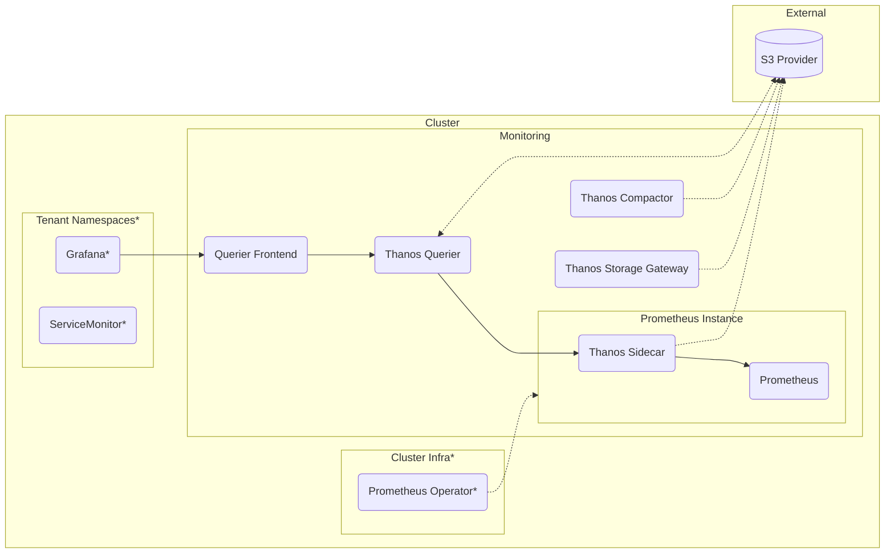

# Prometheus

## Structure



## Setup

Create a Kustomize 

```yaml
apiVersion: kustomize.config.k8s.io/v1beta1
kind: Kustomization

# patch in a namespace for all manifests
namespace: monitoring

resources:
  # you should lock the ref here to a specific tag or commit 
  # (or copy out the manifests to maintain locally)
  - github.com/konstfish/multi-tenant-observability/prometheus?ref=main
  # S3 Object Storage Credential Secret used by Thanos
  - thanos-objstore-secret.yaml
```

### Additional Manifests

#### Object Storage Secret

A secret `thanos-objstore-secret` like [secret.example.yaml](secret.example.yaml) is required, see the [Prometheus Operator docs](https://prometheus-operator.dev/docs/platform/thanos/)

#### Security

NetworkPolicies should be created to prevent access to the Prometheus instances directly & the Thanos Sidecars. Only allowed traffic should 